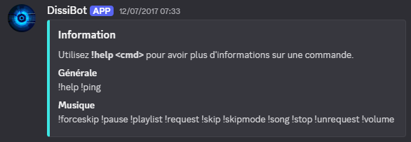
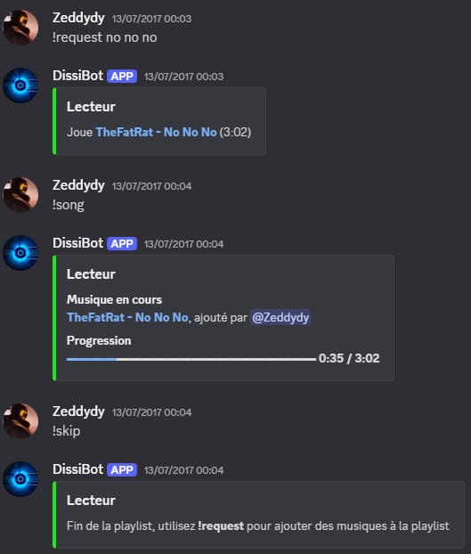

# DissiBot

A music bot that stream music from YouTube to voice chat.

## Presentation

Users can request songs to the bot via fuzzy search or direct YouTube link using the command `!request`. The bot will then join the channel and start broadcast requested music.
Music can be add or remove to the playlist. The bot can display information on the playlist and the song being played. Once the the end of the playlist is reached, the bot will disconnect from the channel.

Users can obtain the list of avalaible commands with the `!help` command :


_Example of interaction with the bot :_


## Dependencies
- [Node.js](https://nodejs.org/en)
  - [discord.js](https://discord.js.org/)
  - [youtube-searsh](https://github.com/MaxGfeller/youtube-search)
  - [ytdl-core](https://github.com/fent/node-ytdl-core)
  - [ffmpeg](https://github.com/damianociarla/node-ffmpeg)
  - [opus](https://github.com/discordjs/opus)
  - [dot-env](https://github.com/motdotla/dotenv)

## Setup and run instructions

- Install all packages by running :
```bash
npm install
```
- Create a Discord App, add it to your server and obtain your private Discord token (see this [link](https://discordjs.guide/preparations/setting-up-a-bot-application.html#creating-your-bot))

- Create a ".env" file in the project folder and add your private token : 
```d
DISCORD_API_TOKEN="<your_token_here>"
```

- You can now run the bot :  
```bash
node dissibot.js
```
